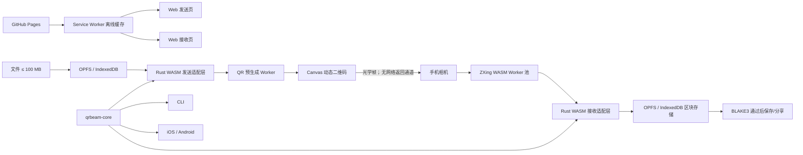

# QRBeam GitHub Pages 发送与接收端设计

- **状态：** 已完成对话设计，等待书面规格审查
- **日期：** 2026-08-07
- **范围：** Web 发送端、Web 接收端、PWA 离线安装、单文件发送页、共享协议兼容更新
- **参考实现：** [Decimen Optical Transfer](https://github.com/bashalarmistalt/decimen-optical-transfer)，参考提交 `29cba8fa25dd160c8b6aa18fe3b48fbc5bde2e36`

## 1. 背景

QRBeam 通过连续变化的二维码，把电脑文件离线传到手机。电脑和手机之间没有局域网、蓝牙、数据线、音频通道或电脑摄像头。用户已经确认手机显示「接收完成」后，由用户在电脑上停止发送。

现有项目包含 Rust 协议核心、电脑 CLI 和 Flutter iOS/Android 接收端。本次新增 GitHub Pages 网页版，提供电脑发送和手机接收两个入口。网页首次联网打开并安装 PWA，之后可在无网络环境启动和传输。

设计借鉴 Decimen 的二维码生成、Canvas 显示、相机 Worker 和简洁页面结构，不复制其 LT 喷泉码协议、品牌或视觉素材。QRBeam 继续使用分段 RaptorQ、区块图、定向回补和确定性时间轴。

## 2. 目标

### 2.1 产品目标

- 同一个 GitHub Pages 站点提供首页、发送页和接收页。
- 手机和电脑首次联网缓存后，可以完全离线启动 PWA。
- 支持不超过 `100,000,000 B` 的单个文件。
- Web、CLI、iOS 和 Android 共用同一套 QRBeam 线协议与 Rust 核心。
- 手机晚开始扫描时，最多等待一轮周期清单即可建立文件会话。
- 丢帧、乱序、重复帧和局部校验失败不清空已接收进度。
- 手机显示文件名、大小、实时有效速度和 FlashGet 式区块图。
- 电脑支持暂停、调速、时间轴定位、前后 `100` 帧、立即重发清单和指定区块回补。
- 单二维码高速档提供 `168.96 kB/s` 理论数据载荷；真实速度在真机验证前明确标记为「没验证」。

### 2.2 工程目标

- Rust 原生端和 WASM 端生成完全一致的帧、清单和时间轴。
- 100 MB 文件处理过程不在 JS 和 WASM 中同时保留多个完整副本。
- PWA 离线缓存覆盖 HTML、CSS、JS、WASM、Worker、图标和路由入口。
- GitHub Actions 自动构建、测试并部署 GitHub Pages。
- Release 同时生成单文件电脑发送页，覆盖电脑首次使用时完全无网的场景。

## 3. 非目标

- 首版不提供加密；任何对准发送屏幕的摄像头都可能读取内容。
- 首版不提供真正的双向自动协商；电脑没有接收手机反馈的物理通道。
- 首版不发送文件夹或多文件队列。
- 首版不把手机 `file://` 单文件接收页作为正式入口，因为移动浏览器无法可靠授予相机权限。
- 首版不采用彩色码、自定义光学码或音频返回通道。
- 双二维码 Turbo 是实验功能，不作为稳定版本性能门槛。
- Apple 签名、App Store 和 Google Play 上架不属于本规格。

## 4. 用户入口与页面结构

GitHub Pages 使用同一站点和 3 个入口：

```text
/qrbeam/          首页
/qrbeam/send/     电脑发送端
/qrbeam/receive/  手机接收端
```

站点使用 History API 不可依赖的静态路径，每个入口都生成独立 `index.html`，避免 GitHub Pages 刷新子路由时返回 `404`。

### 4.1 首页

首页只保留两个主操作：

- 「发送文件」：进入电脑发送端。
- 「接收文件」：进入手机接收端。

页面显示 PWA 安装状态和离线可用状态，不展示协议参数。

### 4.2 发送页

发送页采用 Decimen 式单栏结构：

1. 文件选择器；
2. 最大化二维码画布；
3. 一行状态信息；
4. 默认折叠的「传输控制与高级设置」。

主界面只显示文件名、文件大小、当前 FPS、每帧载荷、理论速率、周期清单状态和当前数据帧地址。以下能力放入折叠面板，但保留快捷键：

| 操作 | 快捷键 | 行为 |
|---|---|---|
| 暂停或继续 | `Space` | 重复当前二维码，不推进数据时间轴 |
| 降速或升速 | `↓` / `↑` | 在已声明档位间切换，会话身份不变 |
| 回退或前进 | `J` / `L` | 按 `100` 个数据帧移动 |
| 定向回补 | `R` | 打开区块号输入框并循环该区块修复符号 |
| 重发清单 | `Home` | 立即插入完整清单轮次，不改变数据游标 |
| 退出当前临时状态 | `Esc` | 退出全屏或区块回补；普通发送状态下不停止 |
| 停止 | `Q` | 结束显示并释放 Wake Lock |

点击二维码进入页面级全屏状态。全屏不依赖 iOS 不完整的 Element Fullscreen API；页面隐藏其他元素，二维码在普通文档流中占满可用视口。再次点击或按 `Esc` 退出。

二维码使用整数倍模块缩放、关闭图像平滑并保留完整静区。物理尺寸不足以满足当前档位最小模块像素时，自动降低二维码密度，而不是绘制模糊的非整数模块。

### 4.3 接收页

接收页采用手机单栏结构：

1. 相机预览与扫描框；
2. 文件名、文件大小、总体进度和实时有效速度；
3. 灰、黄、绿、红区块图；
4. 默认折叠的缺失区块和回补建议；
5. 完成后的保存或分享操作。

区块状态固定为：

| 颜色 | 状态 | 含义 |
|---|---|---|
| 灰 | Missing | 尚未收到有效符号 |
| 黄 | Partial | 已收到部分唯一符号 |
| 绿 | Complete | 区块 CRC32C 已通过 |
| 红 | Failed | 尝试恢复后 CRC32C 失败，等待回补 |

手机显示相机实际分辨率、相机实际 FPS、有效解码 FPS 和最近 `5` 秒有效数据速度。手机可以显示建议档位，但不能自动把结果返回电脑。

## 5. 系统架构



### 5.1 目录与组件边界

新增目录：

```text
apps/qrbeam-web/          Vite、TypeScript、页面、PWA、Worker、浏览器测试
crates/qrbeam-web/        wasm-bindgen 适配层，不直接访问浏览器存储或 DOM
```

职责划分：

- `qrbeam-core`：线协议、清单、RaptorQ、时间轴、区块状态和黄金向量。不得依赖浏览器 API。
- `qrbeam-web`：把纯 Rust 类型转换为稳定的 WASM 接口；不承担页面状态和持久化。
- Web 发送控制器：文件暂存、性能探测、调度、二维码 Worker 和快捷键。
- Web 接收控制器：相机生命周期、ZXing Worker 池、持久化、带宽统计和下载。
- Storage Coordinator：封装 OPFS 与 IndexedDB，向上提供相同的异步区块接口。
- Service Worker：只缓存应用资源，不代理或上传用户文件。

组件之间通过显式值对象通信。DOM、相机、浏览器存储和协议核心不能相互穿透。

### 5.2 100 MB 内存模型

现有 `ReceiveSession` 会保存所有完成区块并最终拼成完整 `Vec<u8>`。Web 里程碑需要把这一行为拆成可插拔存储边界：

- Rust 恢复一个区块后返回 `CompletedSegment { index, bytes }`。
- TypeScript 把区块写入 OPFS，写入确认后通知 WASM 释放区块内存。
- 部分区块的唯一符号写入按区块编号组织的日志；浏览器刷新后可以重建 RaptorQ 解码器。
- WASM 内只保留有限数量的活跃区块解码器，默认 LRU 上限为 `3`。
- 最终校验按区块顺序流式读取并增量计算 BLAKE3，不先生成第二个完整文件副本。
- 原生 App 继续使用内存存储适配器，保持现有 Flutter API 可用。

发送端选择文件后，以流式方式写入 OPFS，同时计算文件 BLAKE3、区块 CRC32C 和可选 gzip。浏览器不支持 OPFS 时回退 IndexedDB。两种存储都不可用或剩余空间不足时，发送或接收在建立会话前失败。

接收端至少预留清单中容器长度的 `120%` 存储空间。最终保存优先使用 File System Access API 的可写流；不可用时由 Service Worker 从 OPFS 流式提供本地下载响应，避免为了保存再创建一个完整 Blob。只有浏览器能力和内存预算允许时才显示 Web Share。

## 6. 协议与性能修订

### 6.1 每帧 11 个符号

QR v40-L 的最大二进制容量为 `2,953 B`。QRBeam 帧头为 `56 B`，最大 payload 为 `2,897 B`。每个 RaptorQ 符号为 `256 B`：

```text
11 × 256 B = 2,816 B
56 B + 2,816 B = 2,872 B ≤ 2,953 B
```

因此正式高速档从每帧 `10` 个符号提高到 `11` 个符号：

```text
11 × 256 B × 60 FPS = 168,960 B/s = 168.96 kB/s
```

协议字段布局不变，但现有 Alpha 1 的档位验证上限是 `10`。Web 发布必须同步更新 Rust、CLI、iOS 和 Android 客户端，并发布新的预览版本。旧 Alpha 1 客户端与新高速清单不声明兼容；它们必须明确拒绝，不能静默误解。

更新后的默认档位为：

| ID | 符号数/帧 | ECC | 目标 FPS | 最小模块像素 |
|---:|---:|---|---:|---:|
| `0` | `1` | M | `8` | `6` |
| `1` | `5` | L | `24` | `6` |
| `2` | `8` | L | `30` | `4` |
| `3` | `11` | L | `60` | `4` |

Web 发送端每次会话固定写入这 `4` 个档位，保证清单大小有明确上界。

### 6.2 屏幕刷新率限制

同一二维码至少显示 `2` 个屏幕刷新周期：

```text
发送 FPS ≤ 实测刷新率 ÷ 2
```

- `60 Hz` 屏幕最高选择 `30 FPS`，理论数据载荷为 `84.48 kB/s`。
- `120 Hz` 屏幕允许 `60 FPS`，理论数据载荷为 `168.96 kB/s`。
- `144 Hz` 屏幕在 v1 中仍受 `60 FPS` 档位上限约束。

页面中的理论值必须由实际档位计算，不能把 `60 FPS` 峰值显示给正在使用 `30 FPS` 的设备。

### 6.3 周期清单与晚加入

发送开始时至少连续发送 `3` 秒稳定清单。进入数据阶段后，每 `2,000 ms` 插入一轮完整清单分片：

- 清单使用稳定档、ECC M 和每帧 `224 B` 清单数据。
- 文件名和 MIME 类型清理后分别限制为 `255 B` UTF-8；不得截断到 UTF-8 码点中间。
- 周期清单不改变 `session_id`、`file_id` 或数据时间轴游标。
- 调度延迟时只插入一轮，不追赶式连续补发多个过期轮次。
- 接收端在同一会话已建立后收到重复清单，只刷新元数据时间，不重置区块状态。
- `Home` 立即安排下一轮清单，但不回退数据时间轴。

典型 100 MB 清单约占 `5` 帧；在 `255 B` 文件名和 MIME 上限下最多约 `7` 帧。在 `60 FPS` 下每 `2` 秒插入典型 `5` 帧后：

```text
(120 - 5) × 2,816 B ÷ 2 s = 161,920 B/s = 161.92 kB/s
```

在最大 `7` 帧清单情况下，净理论数据载荷仍为 `159.10 kB/s`。页面按实际分片数计算显示值。

### 6.4 渐进测速

发送端使用真实文件帧完成渐进探测，不单独发送无效测试数据：

1. 稳定档 `8 FPS`，持续 `2` 秒；
2. 兼容高速档 `30 FPS`，持续 `2` 秒；
3. 屏幕和渲染能力允许时进入 `60 FPS`，持续 `2` 秒；
4. 锁定本机可稳定生成和显示的最高档。

发送端采集显示刷新率、二维码编码耗时、Worker 队列深度和 Canvas 绘制耗时。连续窗口内显示时隙丢失超过 `5%` 时自动降一级。二维码预生成队列固定为 `3` 帧，落后时跳过显示时隙，不突发追赶。

该过程只能衡量发送电脑，不能衡量手机相机。手机无有效帧超过 `3` 秒时显示降速建议，用户在电脑按一次 `↓`。RaptorQ 负责正常范围内的丢帧恢复。

### 6.5 双二维码 Turbo

双二维码使用相同 `global_frame_index`、不同 `channel_id` 和不重叠 ESI。理论上两个 `11` 符号、`60 FPS` 通道可达到 `337.92 kB/s`，但实际速度取决于屏幕尺寸、相机分辨率和多码解码能力。

Turbo 仅在以下条件满足时展示实验开关：

- 两个 QR v40 各自仍能达到至少 `4 px` 的屏幕模块尺寸；
- 发送端本地性能探测可以维持双通道队列；
- 接收端浏览器启用多码解码能力。

Turbo 默认关闭，不进入稳定版性能验收，也不能在 README 中写成实测速率。

## 7. 发送状态机

```text
Idle
  → Preparing
  → ManifestWarmup
  → Probing8
  → Probing30
  → Probing60（能力允许时）
  → Streaming
  ↔ Paused
  ↔ RepairingSegment
  → Stopped
```

- `Preparing`：校验大小、暂存文件、计算散列和区块元数据。
- `ManifestWarmup`：至少发送 `3` 秒完整清单轮次。
- `Probing*`：发送真实数据并测量本机输出能力。
- `Streaming`：按确定性时间轴发送源符号和修复符号，并插入周期清单。
- `Paused`：重复可见二维码；不推进数据时间轴或周期计时。
- `RepairingSegment`：只生成指定区块的新修复 ESI；退出后继续原数据游标。
- `Stopped`：清空 QR、释放 Worker 与 Wake Lock，保留本地发送历史供重新开始。

数据时间轴只记录数据和修复计划。周期清单不进入可拖动的数据时间轴，因此插入清单不会改变 `J`、`L` 或历史回放的确定性。

## 8. 接收状态机

```text
PermissionRequired
  → WaitingManifest
  → Receiving
  ↔ Backgrounded
  ↔ RecoveringStorage
  → Verifying
  → Complete

任何阶段的不可恢复错误 → Failed
```

- `WaitingManifest`：只接受并持久化清单分片；数据帧不改变区块状态。
- `Receiving`：校验帧、去重、恢复区块并更新持久化状态。
- `Backgrounded`：停止相机回调和 Worker 投递，保留会话。
- `RecoveringStorage`：刷新后读取清单、完成区块和部分符号日志。
- `Verifying`：流式读取全部区块并验证容器长度与最终 BLAKE3。
- `Complete`：只有最终 BLAKE3 通过后进入，并提供保存或分享。
- `Failed`：只用于相机、存储或协议无法恢复的错误；用户可以保留或删除本地会话。

ZXing 使用固定 Worker 池。每个相机帧最多投递给一个空闲 Worker；Worker 全忙时直接丢弃新帧，不排队处理过期画面。相机流带代际编号，重启相机后旧回调不得写入新会话。

## 9. 异常处理与恢复

| 场景 | 行为 |
|---|---|
| 相机权限拒绝 | 停留在说明页，提供系统授权路径，不重复弹窗 |
| OPFS 不可用 | 回退 IndexedDB |
| 两种存储都不可用 | 不开始接收，显示浏览器不受支持 |
| 剩余空间不足 | 收到清单后立即提示，不写入部分文件 |
| 无有效帧超过 `3` 秒 | 保留进度，提示调整距离、亮度和发送端降速 |
| CRC 错误帧 | 忽略，不改变进度 |
| 重复帧 | 忽略，不重复统计有效速度 |
| 其他会话数据帧 | 忽略，不改变当前会话 |
| 新会话清单 | 询问是否切换；确认前保留当前进度 |
| 相同会话周期清单 | 接受为刷新，不重置接收器 |
| 页面进入后台 | 暂停相机和 Worker；回前台后恢复 |
| 区块 CRC 失败 | 标红并等待该区块回补，其他区块不倒退 |
| 最终 BLAKE3 失败 | 返回回补状态，绝不显示「接收完成」 |
| 文件超过上限 | 发送端和接收端都拒绝 |

「已验证」只用于最终 BLAKE3 已通过的文件。区块 CRC 通过只能显示「区块完成」。

## 10. PWA、离线与 GitHub Pages

- 使用 Vite 多页构建和 `vite-plugin-pwa` 生成 Service Worker。
- 构建基路径固定支持 GitHub Pages 的 `/qrbeam/` 子路径。
- 首次加载完成后，页面显示「离线可用」；缓存未完成时不能误报。
- Service Worker 预缓存所有版本化应用资源，包括 ZXing WASM、QRBeam WASM 和 Worker。
- 新版本使用内容哈希资源；旧会话完成前不强制刷新页面。
- 断网时导航请求回退到对应多页入口，不回退到错误页面。
- 用户文件和恢复区块只进入 OPFS/IndexedDB，不进入 Cache Storage。
- 传输期间不发起分析、遥测或文件上传请求。

Release 额外生成 `qrbeam-send.html`。该文件内联 Web 发送端所需资源，可直接复制到离线电脑打开；接收端仍使用 PWA 或原生 App。

## 11. 隐私与安全

- 页面必须明确说明：无网络传输不等于保密。
- 任何能看到动态二维码的摄像头都可能接收文件。
- 文件名在发送前清理，接收端保存前再次清理。
- 解析器先校验长度、版本和保留字段，再分配可变内存。
- Service Worker 不缓存用户文件，不把 OPFS 数据暴露为远程 URL。
- GitHub Pages 使用 HTTPS，满足相机权限和 Service Worker 安全上下文要求。

## 12. 测试策略

### 12.1 Rust 与 WASM

- 原生端和 WASM 端使用同一黄金字节向量。
- 覆盖每帧 `11` 个符号的容量边界和越界拒绝。
- 覆盖周期清单不重置会话、不改变数据游标。
- 覆盖 `1 B`、`1 KB`、`1 MB`、`10 MB` 和 `100 MB` 文件。
- 覆盖丢帧、乱序、重复、CRC 损坏、外部会话和最终散列失败。
- 覆盖区块完成后释放内存、持久化确认和恢复重放。

### 12.2 Web 单元与集成测试

- 测试性能探测、档位选择、刷新率上限和 `5%` 降档规则。
- 使用伪时钟验证每 `2,000 ms` 插入清单，延迟时不突发追赶。
- 测试快捷键、时间轴、区块回补和页面全屏状态。
- 测试 OPFS 主路径、IndexedDB 回退和空间不足。
- 在接收 `25%` 与 `75%` 时重载页面，确认恢复后进度不倒退。
- 把生成的 QR 图像施加缩放、模糊、旋转和亮度变化，再交给真实 ZXing WASM 解码。
- 拦截浏览器网络请求，确认传输期间不上传文件数据。

### 12.3 真机矩阵

- 手机：iOS Safari/PWA、Android Chrome/PWA。
- 电脑发送：Chrome、Edge、Safari、Firefox。
- 屏幕：`60 Hz` 与 `120 Hz`。
- 模式：普通单码；实验双码单独记录，不混入稳定结论。
- 场景：权限拒绝、切后台、屏幕锁定、相机重启、存储不足和晚加入。

### 12.4 性能验收

- `60 FPS` 单码实际帧必须携带 `11 × 256 B` 数据载荷。
- 理论速率从当前档位和实际清单分片数计算。
- 周期清单长期运行不得漂移或饿死数据发送。
- `120 Hz` 发送屏幕上的 `10 MB` 真机测试目标为有效速度至少 `100 kB/s`，且最终 BLAKE3 通过。
- 真机结果记录设备、操作系统、浏览器、屏幕刷新率、相机设置、文件大小、有效 FPS、丢帧率和有效速度。
- 未完成真机测试前，README 对实际速度使用「没验证」，不把理论值写成实测值。

## 13. 交付物

- GitHub Pages 首页、发送页和接收页。
- 可安装且断网可启动的 PWA。
- 单文件离线电脑发送页。
- WASM 协议适配层及跨端黄金测试。
- 更新后的 CLI、iOS 和 Android 协议兼容构建。
- GitHub Actions 测试、Pages 部署和 Release 打包工作流。
- 设备性能测试记录和明确的已验证/没验证状态。

## 14. 发布边界

Web 首个可测版本使用新的预发布标签，不覆盖旧的 Alpha 1 资产。发布说明必须包含：

- 新旧协议档位兼容范围；
- GitHub Pages 地址；
- PWA 首次联网要求；
- 单文件发送页、CLI、IPA 和 APK 下载；
- 理论速率与真机实测速率的区别；
- 未签名 IPA 不能直接安装的说明。

本规格通过后，下一步只编写实施计划，不直接开始实现。实施计划按协议与存储边界、WASM、发送页、接收页、PWA/Pages、跨端兼容和真机验收拆成可独立验证的小任务。
